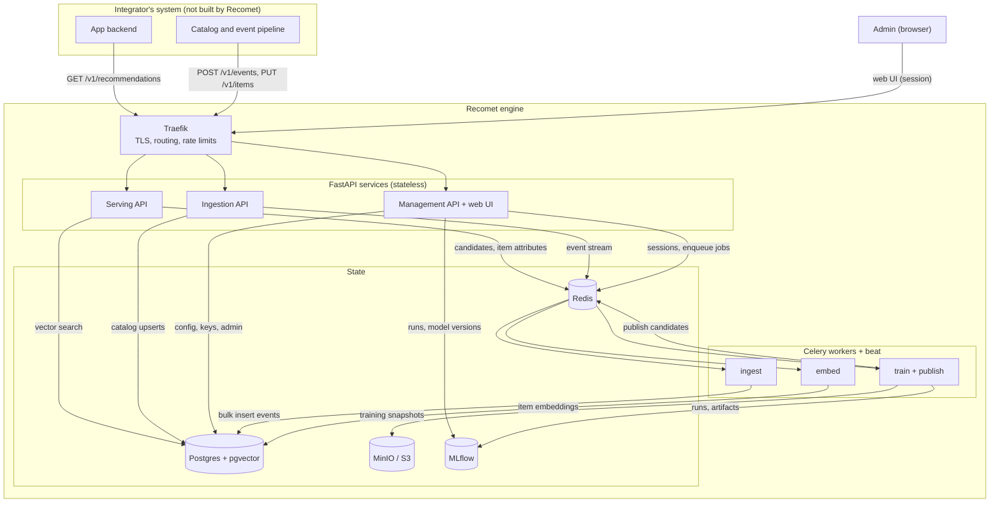
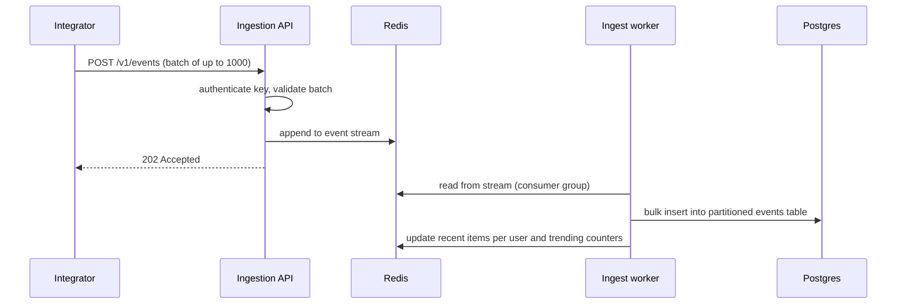
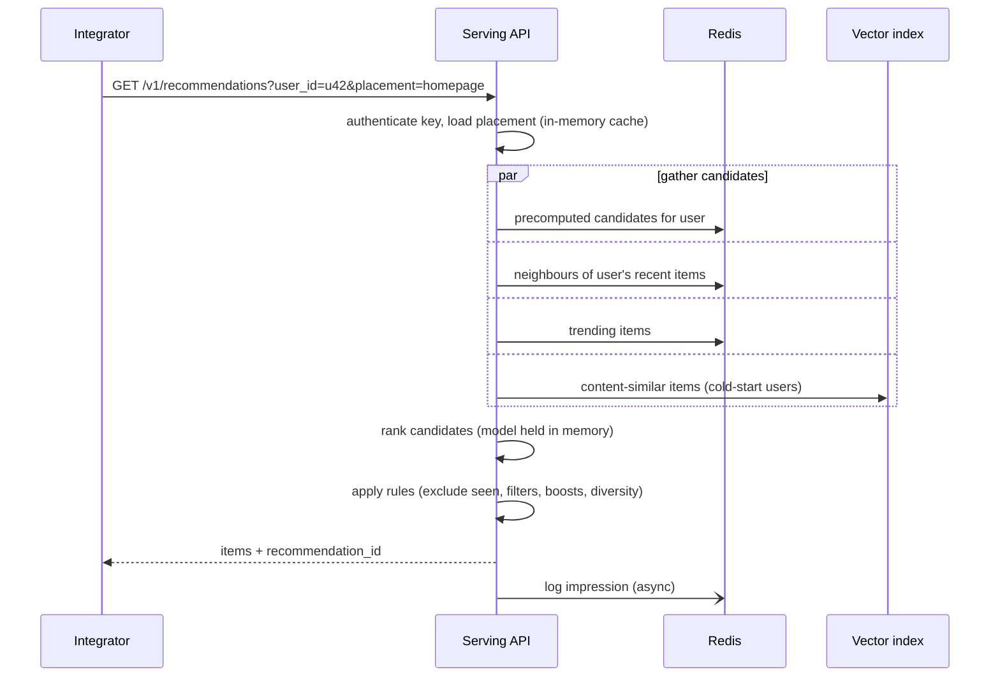

# Recomet Architecture

> **Status:** Draft · **Last updated:** 2026-09-11

## 1. What Recomet is

Recomet is an open-source, self-hosted recommendation engine. Teams send it their catalog and
user interaction events over a REST API, configure how recommendations behave in a built-in web
UI, and fetch personalized recommendations with a single API call.

It is **domain-agnostic**: it only knows about *items*, *users*, and *events*. The same engine
can power an online store, a news site, or a job board — the integrator decides what an item is
and what an event means.

**Design goals**

1. **Easy to adopt** — `docker compose up`, a guided first-run setup, send data, get recommendations.
2. **Production-grade** — authenticated, observable, never returns an empty result, safe model rollouts.
3. **Scales by configuration** — the same code runs on one VM or a Kubernetes cluster.
4. **Modular** — storage backends and algorithms are swappable behind stable interfaces.

## 2. System boundary

Recomet is a standalone engine with its own web UI. It exposes APIs; it does **not** build or
ship anything that runs inside the integrator's product.

| Recomet is responsible for | The integrator is responsible for |
|---|---|
| Storing catalog, users and events | Capturing events in their app and sending them to Recomet |
| Training, evaluating and versioning models | Calling the recommendations API |
| Serving recommendations with business rules applied | Rendering recommendations in their own UI |
| The admin web UI | Sending click/purchase events back with the `recommendation_id` |
| Access control for its admin account and API keys | Keeping end-user IDs pseudonymous (no emails or names) |

## 3. Who uses it

| Actor | What they do | How they access Recomet |
|---|---|---|
| **End users** (shoppers, readers) | Nothing directly — they are IDs in the data | Never |
| **Admin** (one account) | Runs setup, manages projects and keys, configures placements, trains and promotes models | Web UI (username + password) |
| **Integrator's systems** | Send data, fetch recommendations | API keys (`ingest`, `serve`) |
| **Automation** (CI, scripts) | Configure projects, trigger training | API keys (`admin`) |

v1 has exactly **one human account**. Other people who tune recommendations — data analysts
checking metrics, merchandisers setting business rules — use that account. Separate accounts
with roles are planned for later (see [Scope](#14-scope)); the permission model is already
designed so they can be added without changing any endpoint.

## 4. Architecture overview



## 5. Components

### 5.1 Services

One Python package (`recomet`), one container image, three entrypoints. On a single VM they can
run as one process; at scale each is deployed and scaled independently so that an ingestion
spike can never slow down recommendation serving.

| Service | Responsibilities | Routes | Auth | Scales with |
|---|---|---|---|---|
| **Serving API** | Candidate retrieval, ranking, rules, fallbacks | `GET /v1/recommendations`, `GET /v1/items/{id}/similar` | API key | Read traffic |
| **Ingestion API** | Validate and accept data | `POST /v1/events`, `PUT /v1/items`, `PUT /v1/users`, `DELETE /v1/users/{id}` | API key | Write traffic |
| **Management** | JSON management API and the web UI | `/v1/projects`, `/v1/placements`, `/v1/models`, `/v1/keys`, ... and `/`, `/setup`, `/login`, ... | API key (`/v1`), session (UI) | Operators (low) |

The JSON management API and the web UI call the **same service layer**. The UI never calls the
HTTP API over the network, and every action available in the UI is also available through the API.

### 5.2 Workers

Celery workers consume from **separate queues** so heavy jobs cannot starve light ones.
Celery beat schedules recurring work.

| Queue | Jobs |
|---|---|
| `ingest` | Drain the event stream into Postgres; update recent-items lists and trending counters in Redis |
| `embed` | Compute content embeddings for new or changed items |
| `train` | Snapshot data, train, evaluate, register, publish |

### 5.3 State

| Store | Holds | Role |
|---|---|---|
| **Postgres** | Admin account, projects, API keys, catalog, events, placements, model metadata | Source of truth |
| **pgvector** (in Postgres) | Item embeddings | Vector index (small/medium tier) |
| **Redis** | Precomputed candidates, item neighbours, trending lists, recent items per user, filterable item attributes, event stream, job queue, sessions, rate limits, pub/sub | Hot-path data and messaging |
| **MinIO / S3** | Training snapshots (Parquet), model artifacts | Bulk and immutable data |
| **MLflow** | Experiment runs, metrics, model registry | Model lifecycle |

### 5.4 Web UI

Server-rendered with **Jinja2** templates, served by the management service. **HTMX** handles
interactive parts (training progress, playground, key creation) without a JavaScript build step.

- **Setup** — first-run wizard (see [7.1](#71-first-run-setup))
- **Projects** — create and switch projects
- **API keys** — create named keys with scopes, revoke, see when each was last used
- **Data** — browse catalog and events; define event types and their weights
- **Placements** — configure strategy blend and rules per placement
- **Models** — training history, metrics, promote and roll back
- **Playground** — pick a user, see recommendations and why each was chosen
- **Metrics** — impressions, click-through rate and latency per placement
- **Account** — change the admin password

### 5.5 CLI

The `recomet` command ships in the same image and is run with `docker compose exec engine recomet ...`.

| Command | Purpose |
|---|---|
| `recomet migrate` | Apply database migrations (runs automatically on startup) |
| `recomet setup-code` | Generate a one-time code for the setup wizard |
| `recomet reset-password` | Set a new admin password; prompts without echoing |
| `recomet serve` / `recomet worker` | Start a service or worker |

No CLI command ever prints an API key.

## 6. Domain model

| Entity | Key fields | Notes |
|---|---|---|
| **InstanceState** | `setup_completed_at`, `setup_code_hash`, `setup_code_expires_at` | Single row; controls first-run setup |
| **AdminUser** | `username`, `password_hash`, `password_changed_at` | Exactly one row in v1 |
| **Project** | `id`, `name` | Isolation boundary; every entity below belongs to one |
| **ApiKey** | `name`, `prefix`, `hash`, `scopes`, `last_used_at`, `expires_at`, `revoked_at` | Only the hash is stored |
| **Item** | `id`, `attributes` (JSONB), `text`, `active` | Integrator-defined attributes; `text` feeds content embeddings |
| **User** | `id`, `attributes` (JSONB) | An end user; pseudonymous ID supplied by the integrator |
| **EventType** | `name`, `weight` | e.g. `view=1`, `add_to_cart=3`, `purchase=5` |
| **Event** | `event_id?`, `user_id`, `item_id`, `type`, `timestamp`, `recommendation_id?`, `context` | `event_id` makes retries idempotent |
| **Placement** | `name`, `strategy`, `rules`, `fallbacks` | A named recommendation slot, e.g. `homepage` |
| **ModelVersion** | `id`, `algorithm`, `metrics`, `status`, `mlflow_run_id` | `status`: `candidate`, `production`, `archived` |

External IDs are strings chosen by the integrator. Internally they map to dense integer indices,
which the ML code needs for interaction matrices and compact candidate lists.

A **placement** is how integrators customize behaviour without code. It defines which retrievers
contribute candidates and with what weight, which ranker orders them, and which rules apply
(exclude seen items, filter on attributes, boost, diversity limits).

## 7. Key flows

### 7.1 First-run setup

Database migrations run automatically before the engine accepts traffic, so the schema is ready
before anyone opens the wizard. While no admin exists, every UI route redirects to `/setup` and
the logs show where to go next — without printing any secret:

```
Recomet is not set up yet.
1. Run: docker compose exec engine recomet setup-code
2. Open: http://localhost:8000/setup
```

**Wizard steps**

1. **Verify** — enter the one-time setup code. The code proves the person in the browser has
   access to the server; without it, anyone who reached `/setup` first could claim the instance.
2. **System check** — database schema, Redis, object storage and MLflow are all reachable.
3. **Admin account** — choose a username and password (at least 12 characters).
4. **First project** — name it; default event types are created (`view=1`, `add_to_cart=3`,
   `purchase=5`) and can be changed later.
5. **Create** — the admin account, project and first API key are created in **one transaction**.
   Abandoning the wizard earlier leaves nothing behind.
6. **API key** — the key (scopes `ingest` + `serve`) is shown **once**, with a copy button. The
   admin must confirm they have stored it before continuing.
7. **Done** — the admin is logged in and lands on a quickstart page showing how to send the first
   events (with a placeholder where the key goes, never the key itself).

After step 5, setup is locked: `/setup` returns `404` and the setup code is invalidated.

**Setup code rules**

- 32 random characters, valid for 30 minutes, stored only as a hash.
- `recomet setup-code` replaces any previous code each time it runs.
- Wrong attempts are rate-limited.
- It is a bootstrap secret, not an API key: it grants nothing once setup is complete.

### 7.2 Event ingestion



The API only validates and appends to the stream, so it responds in milliseconds and absorbs
traffic spikes. If workers fall behind beyond a configured lag, the API returns `429` with
`Retry-After` instead of silently dropping data.

### 7.3 Catalog updates

`PUT /v1/items` upserts into Postgres, stores filterable attributes in Redis, and enqueues an
`embed` job. The worker computes a content embedding and writes it to the vector index. A new
item is recommendable within seconds, before anyone has interacted with it (cold start).

### 7.4 Training and publishing

Triggered by schedule, by data volume, or manually from the UI or API.

1. **Snapshot** — export the training window of events to Parquet in object storage.
2. **Train** — every retriever and the ranker configured for the project.
3. **Evaluate** — on a time-based holdout: NDCG@10, Recall@50, catalog coverage.
4. **Register** — log the run, metrics and artifacts in MLflow as a `candidate` version.
5. **Promote** — automatically if it beats production by a configured margin, or manually.
6. **Publish** — write item embeddings, item neighbours and per-user candidates under
   versioned keys (`v42:*`), then atomically switch the project's active-version pointer.

Versioned publishing means users never see a half-updated model, and rollback is a pointer
switch back to the previous version.

### 7.5 Serving



- **Fallback chain:** precomputed → real-time → trending → popular. The response is never empty.
- **Latency target:** p95 < 50 ms.
- **Hot-path rule:** serving reads only Redis, the vector index and in-memory models. It never
  queries relational tables. Placement config and API keys are cached in process and
  invalidated via Redis pub/sub.

### 7.6 Feedback

Events that carry a `recommendation_id` are attributed to the placement and model version that
produced them. Workers roll them up into hourly aggregates that power the UI's click-through-rate
charts. The same events become training data for the next model.

## 8. ML pipeline

Recommendations are produced in two stages: **retrieval** (several retrievers each propose
candidates) and **ranking** (one model orders the merged set).

| Component | Type | Purpose |
|---|---|---|
| Popularity (time-decayed) | Retriever | Baseline and final fallback |
| Item-to-item co-occurrence | Retriever | "People who interacted with X also interacted with Y" |
| Matrix factorization (implicit ALS) | Retriever | Personalized candidates from learned user and item embeddings |
| Content embeddings (sentence-transformers) | Retriever | Cold start for new items and users |
| LightGBM LambdaRank | Ranker | Orders merged candidates using user, item and context features |

Every model is evaluated with the same offline harness on a time-based split, so each addition
must beat the previous best. Reference benchmark datasets: MovieLens 1M (development) and
MovieLens 25M (scale).

**Freshness between retrains:** candidates from a user's most recent items are computed at
request time, and ALS fold-in can update a user's vector from new interactions without a full
retrain.

## 9. Modularity

Recomet follows a **ports and adapters** design. The core defines interfaces (Python
`Protocol`s); adapters implement them; configuration selects which adapter runs.

| Port | Purpose | v1 adapter | Planned adapters |
|---|---|---|---|
| `VectorIndex` | Store and search item embeddings | pgvector | Qdrant |
| `EventBus` | Buffer incoming events | Redis Streams | Kafka / Redpanda |
| `CandidateStore` | Precomputed candidates and neighbours | Redis | Redis Cluster |
| `ObjectStore` | Snapshots and artifacts | S3 API (MinIO) | Any S3-compatible store |
| `ModelRegistry` | Model versions and metrics | MLflow | — |

Algorithms are plugins too: `Retriever`, `Ranker` and `Rule`.

- **Selection by config** — e.g. `RECOMET_VECTOR_BACKEND=qdrant`.
- **Third-party plugins** — discovered through Python entry points, so `pip install recomet-qdrant`
  is enough to make a new adapter available.
- **Contract tests** — each port has one shared test suite that every adapter must pass. This is
  what makes swapping safe in practice.

**Code layout**

```
recomet/
  core/       domain models and ports; no I/O, depends on nothing
  services/   use cases shared by the JSON API and the web UI
  adapters/   postgres, pgvector, redis, s3, mlflow
  ml/         retrievers, rankers, training, evaluation
  api/        JSON routers: serving, ingestion, management
  web/        Jinja templates, HTMX views, static files
  workers/    celery tasks and schedules
  cli/        migrate, setup-code, reset-password, serve, worker
```

Dependency rule: `core` imports nothing from the other packages; everything else depends on `core`.

## 10. Security and access control

### 10.1 Principals and permissions

Every request is authenticated into a **principal** — whoever is making the request — which holds
a set of permissions per project. Endpoints declare the permission they need, and one shared
check enforces it:

```python
@router.post("/v1/projects/{project_id}/models/{model_id}/promote",
             dependencies=[require("models:promote")])
```

v1 has two kinds of principal:

| Principal | Authenticated by | Permissions |
|---|---|---|
| **Admin user** | Session cookie (web UI only) | Everything, in every project |
| **API key** | `Authorization: Bearer` header (`/v1` only) | Those granted by its scopes, in its own project |

Adding human accounts with roles later means adding a third kind of principal. No endpoint changes.

A request for a project the principal cannot access returns `404`, not `403`, so the project's
existence is not revealed.

### 10.2 API keys

Keys belong to one project and carry one or more scopes:

| Scope | Allows | Typical holder |
|---|---|---|
| `ingest` | Send events and catalog updates, delete end-user data | Integrator's data pipeline |
| `serve` | Fetch recommendations and similar items | Integrator's app backend |
| `read` | View configuration, metrics and models | Monitoring, reporting |
| `admin` | Everything in the management API for that project | CI and automation |

**Handling rules**

- Format: `rk_` followed by 32 random bytes (base62). The first characters are stored as a visible
  prefix so keys can be identified in the UI.
- Stored as a SHA-256 hash. Keys are long random values, so a fast hash is safe; passwords use
  argon2id because they are not.
- Shown **exactly once**, in the web UI, on a page served with `Cache-Control: no-store`.
  Never printed to the terminal, written to logs, or placed in URLs.
- Accepted only in the `Authorization` header. The engine and Traefik never log that header.
- A lost key cannot be recovered: create a new one and revoke the old one.
- Each key records when it was last used, can expire, is rate-limited, and can be revoked
  instantly (revocation reaches the serving cache via pub/sub).

### 10.3 Admin account and sessions

The web UI uses server-side sessions stored in Redis, not JWTs — see
[ADR 0012](adr/0012-session-cookies-and-api-keys-instead-of-jwt.md).

- Username and password, hashed with argon2id; minimum 12 characters.
- Login attempts rate-limited per IP address and per username.
- Forgotten password: `recomet reset-password` on the server. No email is required.

**Session handling**

| Concern | Measure |
|---|---|
| Session ID | 256-bit random value; a new ID is issued at every login (prevents session fixation) |
| Storage | Redis holds only a SHA-256 hash of the ID, so a leaked Redis dump cannot be used to log in |
| Cookie | Named `__Host-recomet_session`; `httpOnly`, `Secure`, `SameSite=Lax`, `Path=/`, no `Domain` |
| Lifetime | Expires after 12 hours of inactivity or 7 days after login, whichever comes first |
| Revocation | Logout deletes the session; a password change or reset deletes all sessions |
| CSRF | Token required on every form and HTMX request that changes data |
| Transport | HTTPS only, with HSTS |
| XSS | Jinja autoescaping and a strict Content Security Policy (no inline scripts) |

For local development over plain HTTP, `RECOMET_DEV_MODE=true` drops the `__Host-` prefix and
the `Secure` flag and shows a warning banner in the UI. It must never be enabled in production.

## 11. Scaling

**Principles**

1. Heavy work happens offline; the hot path only does lookups.
2. Services are stateless and scale horizontally; state lives in the data stores.
3. Workloads are isolated in separate deployments and queues.
4. Growth means swapping adapters through configuration, not rewriting code.

**Pressure points at 10M users, 1M items, ~1B events**

| Pressure point | Mitigation |
|---|---|
| Thousands of recommendation requests per second | More Serving API replicas, autoscaled on latency; hot path is lookups only |
| Precomputed candidates for 10M users | Precompute only for active users (~3M × 200 × 4 B ≈ 2.4 GB); compute the rest on request; Redis Cluster when one node is not enough |
| Event bursts of tens of thousands per second | Stream buffer, bulk inserts, more ingest workers; Kafka at the top end |
| ~1B stored events | Monthly partitions; older partitions archived to Parquet and dropped; training reads Parquet, never the live database |
| Training time | Train on a recent window (e.g. 90 days); GPU for ALS; shard precomputation by user range |
| Vector search over 1M items | pgvector HNSW, then Qdrant with quantization and sharding |
| Database load | PgBouncer, read replica for the UI, pre-aggregated metrics |

**Deployment tiers** (same code, different configuration)

| | Small | Medium | Large |
|---|---|---|---|
| Users | < 100k | ~1M | 10M+ |
| Deployment | One VM, Docker Compose | Compose or Kubernetes | Kubernetes + Helm |
| APIs | One container | 2–4 replicas | Autoscaled per service |
| Event bus | Redis Streams | Redis Streams | Kafka / Redpanda |
| Vector index | pgvector | pgvector | Qdrant |
| Redis | Single node | Primary + replica | Redis Cluster |
| Training | CPU, same VM | Dedicated worker | GPU worker |

Scale claims are only made after they are measured: load tests with k6 against MovieLens 25M and
a synthetic 10M-user dataset, with results published in the repository.

## 12. Reliability and operations

- **Never empty** — every placement ends in a fallback chain.
- **Safe rollouts** — versioned publishing with atomic switch and one-step rollback.
- **Safe migrations** — applied on startup by a one-shot `migrate` step, guarded by a Postgres
  advisory lock so concurrent replicas cannot run them twice. Web requests never change the schema.
- **Idempotency** — events carry an optional `event_id` for deduplication; catalog writes are upserts.
- **Backpressure** — ingestion returns `429` when workers fall too far behind.
- **Rate limits** — per API key, enforced at the edge and in the API.
- **Observability** — Prometheus `/metrics` on every service, structured JSON logs with request
  IDs and secrets redacted, `/healthz` and `/readyz` endpoints.
- **Configuration** — environment variables only (12-factor).
- **Data deletion** — `DELETE /v1/users/{id}` removes a user's events and cached recommendations.

## 13. Technology stack

| Layer | Technology |
|---|---|
| API | Python, FastAPI, Pydantic, SQLAlchemy 2.0, Alembic |
| Web UI | Jinja2, HTMX, a no-build CSS framework (e.g. Pico.css), Chart.js |
| Security | argon2-cffi, Redis-backed sessions |
| Background jobs | Celery, Celery beat |
| ML | implicit, LightGBM, sentence-transformers, Polars |
| Data stores | Postgres + pgvector, Redis, MinIO (S3 API) |
| Model lifecycle | MLflow |
| Edge | Traefik |
| Observability | Prometheus |
| Delivery | Docker Compose, GitHub Actions, k6 |

## 14. Scope

Recomet v1 is deliberately limited. The interfaces for later features exist from the start;
the implementations do not.

**v1 — core**

- Ingestion, serving and management APIs with scoped API keys and rate limits
- First-run setup wizard, single admin account, web UI (Jinja + HTMX)
- Training pipeline: popularity, item-to-item, ALS, content embeddings, LightGBM ranker
- Offline evaluation harness and MLflow model registry
- Placements with rules and fallbacks
- Recommendation attribution and click-through rate
- One adapter per port, with contract tests
- Docker Compose deployment, CI, `/metrics`, health checks

**Later**

- Multiple human accounts with roles (Owner, Admin, Editor, Viewer)
- SSO (OIDC), MFA, password reset by email
- Non-interactive setup for automated deployments
- Large-tier adapters: Qdrant, Kafka / Redpanda, Redis Cluster; Helm chart
- Published load-test results at the 10M-user tier
- A/B experiments between placements or model versions
- Outbound webhooks (`model.promoted`, `import.completed`, ...)
- Generated client SDKs (Python, TypeScript)
- Browser-safe tokens: short-lived, narrowly scoped JWTs minted by the integrator's backend
- Audit log, Grafana dashboards, distributed tracing
- Neural retrieval (two-tower model)

**Out of scope**

- Anything that runs inside the integrator's product (UI widgets, tracking scripts)
- Hosted multi-organization SaaS, billing
- Real-time streaming training, multi-region deployment

## 15. Decisions to record

Each of these gets an Architecture Decision Record in `docs/adr/`:

1. Standalone FastAPI engine (Django considered and rejected)
2. Modular monolith with three deployable entrypoints
3. Ports and adapters with contract tests
4. Two-stage retrieval and ranking
5. Offline precompute with online re-ranking
6. Redis Streams as the v1 event bus
7. Postgres + pgvector as the v1 store and vector index
8. Versioned publishing with atomic switch
9. Single admin account plus scoped API keys, with principal-based permission checks
10. First-run setup wizard secured by a one-time setup code
11. Server-rendered web UI with Jinja2 and HTMX
12. [Session cookies and API keys instead of JWT](adr/0012-session-cookies-and-api-keys-instead-of-jwt.md) — *accepted*
